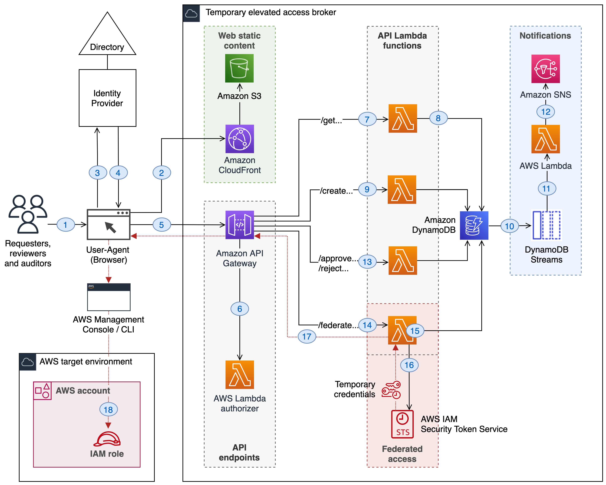

# A minimal reference implementation for temporary elevated access

This is a minimal reference implementation for providing temporary elevated access to your AWS environment.

For a high-level overview of temporary elevated access, including a walk through for this reference implementation, see the blog post [Managing temporary elevated access to your AWS environment](https://aws.amazon.com/blogs/security/managing-temporary-elevated-access-to-your-aws-environment/) on the AWS Security Blog.

## Contents

* [Deploying the solution](#deploying-the-solution)
* [Using the solution](#using-the-solution)
* [Extending the solution](#extending-the-solution)
* [Security considerations](#security-considerations)
* [Design principles](#design-principles)

## Deploying the solution

### Solution overview

The solution comprises a *temporary elevated access broker*, which includes the following main components:

* A web application ("app UI") that runs in the browser, known as a Single Page Application (SPA)
* A CloudFront distribution to serve static content
* Server-side APIs hosted by Amazon API Gateway and AWS Lambda
* A DynamoDB table to track the status of temporary elevated access requests



The broker users your existing identity provider to authenticate users. It conditionally grants those users time-bound access to your AWS environment (the "AWS target environment") by allowing them to assume specially configured IAM roles ("target roles").

By default, the solution is entirely serverless and does not need to access any resources within a VPC. If you want network traffic to remain in your private network, see [Extending the solution](#extending-the-solution).

### Using the broker alongside your existing access solution

If you already use AWS Single Sign On (SSO) or any other solution to manage persistent access to your AWS environment, you can continue to use that solution alongside the temporary elevated access broker.

* Continue using your existing access solution for persistent access, such as read-only access, or access to non-production environments
* Use the temporary elevated access broker only for access that you consider high-risk, where persistent access is not allowed based on your requirements

Users who do not need high-risk access can continue using your existing access solution without any disruption to their workflow.

### **Prerequisites**

Due to restrictions on Lambda@Edge, the template must be launched in the US East (N. Virginia) Region. Once deployed, Lambda@Edge will be replicated in CloudFront edge locations worldwide.

The deployment requires an existing Amazon S3 bucket to upload the serverless code artifacts that the CloudFormation template generates. For instructions on creating an S3 bucket, see [Creating a bucket](https://docs.aws.amazon.com/AmazonS3/latest/userguide/create-bucket-overview.html).

We recommend deploying the broker in its own dedicated AWS account (the "broker account"). Ideally, the broker account should:

* be logically segregated from the AWS target environment
* if using AWS Organizations, the broker account should not be your organization's management account (it may be a member account)
* have a minimum of dependencies on the AWS target environment
* use its own access control configuration and deployment pipeline
* be managed by a specialized team (e.g. security operations)
* ideally use a two-person rule for making changes - for example by requiring different users to check in code and approve deployments

The default broker implementation is configured to use Okta as the identity provider, and the build instructions below assume you are using Okta. To use a different identity provider or if your identity provider does not support OIDC, see [Extending the solution](#extending-the-solution).

### **Dependencies**

The following third-party dependencies are used in this application.

 * [Python libraries used in API Lambda functions](lambda-layer/python/requirements.txt)
 * [JWT decoder and Okta OIDC verification used in Lambda authorizer](okta-authorizer/package.json)
 * [NPM libraries used in the browser-based App UI](ui-frontend/package.json)

Always stage any third-party libraries in your local environment and perform security scans on them before deploying. Avoid pulling dependencies directly from external third-party sources as part of your build and deploy process.

### **Development environment setup**

You can use your favorite development environment to build and deploy the solution. We highly recommend using an IDE that supports code-completion and syntax highlighting.

[AWS Cloud9](https://aws.amazon.com/cloud9/) is a Cloud based IDE that you can provision directly from your AWS account. It comes prepackaged with essential tools for popular programming languages, including JavaScript, Python, PHP, and more, so you don't need to install files or configure your development machine to start new projects. For instructions on creating a Cloud9 development environment, please see [Creating an environment in AWS Cloud9](https://docs.aws.amazon.com/cloud9/latest/user-guide/create-environment-main.html).

If you are using an IDE on your local machine, make sure you have the following installed:

* [AWS CLI](https://aws.amazon.com/cli/)
* [Node.js and NPM](https://nodejs.org/en/download/)
* [GIT client](https://git-scm.com/download)
* [Python 3.x](https://www.python.org/downloads/)

### **Packaging artifacts**

From your terminal application, execute the following command. This creates a directory named `aws-iam-temporary-elevated-access-broker` in your current directory.

```
git clone https://github.com/aws-samples/aws-iam-temporary-elevated-access-broker
cd ./aws-iam-temporary-elevated-access-broker
```

The solution uses several [libraries](lambda-layer/python/requirements.txt) that are not included with the standard Python package that Lambda uses. Lambda layers provide a convenient and effective way to package code libraries for sharing with Lambda functions in your account. The following command will install the packages according to the configuration file `requirements.txt` so it can be packaged with your function code.

From within the `/lambda-layer/python` directory run:

```
pip install -t . -r requirements.txt
```

This will download and install all of the requirements into the `/lambda-layer/python` folder.

The `/okta-authorizer` directory contains a Node.js package.json file. From within the directory, install the package.json contents:

```
npm install
```

This will create the `node_modules` directory in your current directory and will download the required packages to that directory. 

From the root project directory, run the following command to upload your artifacts to S3 and output a packaged template that can be readily deployed to CloudFormation. Replace `bucket-name` with your target S3 bucket:

```
$ aws cloudformation package \
--template-file template.yaml \
--s3-bucket bucket-name \
--output-template-file packaged-template.yaml
```

The package command will then zip the local code, push it to S3, and output a new template with the proper references to the bucket and newly-uploaded objects. Whenever changes are made to the Lambda code or template.yaml, `cloudformation package` must be run as part of deploying those changes.

### **Deploying the broker**

Using the **packaged-template.yaml** file generated in the previous step, you can now deploy the required serverless resources into the broker account.

1. Navigate to the AWS CloudFormation console. Choose the US East (N. Virginia) Region, and then choose **Create Stack**. Select **With new resources**.
2. Choose **Upload a template file,** select your CloudFormation stack file, and then choose **Next**.
3. Enter the stack name and values for the other parameters, and then choose **Next**. The parameters are defined as follows:
    1. **Notifications setup**
        1. **ApprovalSNSTopicName**: A name for the SNS topic that will receive the approval notifications. 
        2. **SubscriptionEndPoint**: The endpoint (i.e. email address) for the Amazon SNS topic. Additional subscribers can be added via the [SNS Console](https://docs.aws.amazon.com/sns/latest/dg/sns-create-subscribe-endpoint-to-topic.html)
        3. **SubscriptionProtocol**: The subscription's protocol. For more information, see the Protocol parameter of the [Subscribe](https://docs.aws.amazon.com/sns/latest/api/API_Subscribe.html) action in the Amazon SNS API Reference.
        4. **SenderSESAddress:** The email address that is sending the notification emails.
           NOTE: This email address must be either individually verified with Amazon SES, or from a domain that has been verified with Amazon SES. For information about verifying identities, see the [Amazon SES Developer Guide](https://docs.aws.amazon.com/ses/latest/DeveloperGuide/verify-addresses-and-domains.html)
    2. **DynamoDB setup**
        1. **DBTableName**: A name for the DynamoDB table that will hold request information. 
        2. **PointInTimeRecovery:** Indicates whether point in time recovery is enabled (true) or disabled (false) on the table.
    3. **Okta setup**
        1. **ClientId:** The client ID of the SPA application. This can be found on the "General" tab of an application, or the list of applications. This identifies the application that tokens will be minted for. See [Integrating with your identity provider](#integrating-with-your-identity-provider), below.
        2. **JWTIssuer:** This is the URL of the authorization server that will perform authentication. All Developer Accounts have a "default" authorization server. The issuer is a combination of your Org URL (found in the upper right of the console home page) and `/oauth2/default`. For example, https://dev-1234.oktapreview.com/oauth2/default.
        3. **Audience:** The expected audience passed to verifyAccessToken(). This can be either a string (direct match) or an array of strings (the actual aud claim in the token must match one of the strings). See [API Access Management with Okta](https://developer.okta.com/docs/concepts/api-access-management/) for additional information. 
    4. **Group setup**
        1. **SearchPrefix:** Group search prefix (i.e. *aws-temp*). All groups should be created with this prefix to simplify the identification of roles in AWS that are accessed through the federated authentication process.
        2. **ReviewerGroup**: Group for determining *Reviewer* authorization.
        3. **AuditorGroup**: Group for determining *Auditor* authorization.
    5. **API Gateway setup**
        1. **Stage:** The stage where the application is running in, e.g. *dev*, *prod*.
    6. **Logging setup**
        1. **RetentionInDays**: The number of days to retain the log events

Acknowledge creation of AWS resources and choose to continue to deploy AWS resources through AWS CloudFormation. The CloudFormation stack creation process is initiated, and after a few minutes, upon completion, the stack status is marked as **CREATE_COMPLETE**. Make note of your stack output values. 

NOTE: If you delete the stack, you may get a **DELETE_FAILED** error. This happens because when you delete the stack, CloudFormation tries to delete the master Lambda@Edge function. The master Lambda Function, however, can only be deleted after CloudFront removes all of the Lambda@Edge replicas, which can take some time to complete. This helps prevent a situation where a replica is deleted that is still in use, which would result in an error. In the case of a failed deletion, wait a few hours, and then try again to delete the stack. 

### Integrating with your identity provider

The broker integrates with your identity provider using OpenID Connect (OIDC) using the Authorization Code Flow with PKCE. In OAuth terminology:

* The app UI running in the browser is the *client*
* The identity provider acts as the *Authorization Server*
* Server-side APIs hosted by Amazon API Gateway in the broker account act as the *Resource Server*

When users authenticate, the app UI receives two signed tokens from the identity provider: an *access token* and *ID token*:

* The *access token* grants the browser application delegated authority to call back-end APIs on behalf of the user
* The *ID token* contains claims representing the authenticated user's attributes and group memberships

The app UI passes both tokens to the API endpoints where they validated by a Lambda authorizer. 

If you are using Okta as your identity provider, you will need the following prerequisites:

* An Okta account:
    * To create a Developer Account to use in a non-production environment, sign up at https://developer.okta.com/signup/
* An Okta Application, configured for Single-Page App (SPA) mode:
    * This is done from the Okta Developer Console, you can see the [OIDC SPA Setup Instructions](https://developer.okta.com/docs/guides/implement-auth-code-pkce/overview/)
* In your Okta Application, make note of the following information from the Okta Developer Console:
    * **Client Id**: The client ID of the SPA application you created. This can be found on the "General" tab of an application, or the list of applications. This identifies the application that tokens will be minted for.
    * **Issuer**: This is the URL of the authorization server that will perform authentication. All Developer Accounts have a "default" authorization server. The issuer is a combination of your Org URL (found in the upper right of the console home page) and `/oauth2/default`. For example, https://dev-1234.oktapreview.com/oauth2/default.
    * **Audience**: The expected audience passed to verifyAccessToken(). This can be either a string (direct match) or an array of strings (the actual `aud` claim in the token must match one of the strings). In the general case, the `aud` value is an array of case sensitive strings, each containing a `StringOrURI` value. Currently, Okta supports only one audience. See [API Access Management with Okta](https://developer.okta.com/docs/concepts/api-access-management/) for additional information. 

### Creating authorization groups

The broker uses role-based access control (RBAC) to authorize users. Determining how you will create and delineate your groups and IAM roles in AWS is crucial to how you secure access to your AWS target environment.

By default, the broker expects the following groups to exist in your identity provider. 

| Group name                              | Description           | Meaning                                    |
| --------------------------------------- | --------------------- | ------------------------------------------------------------ |
| `aws-temp#<role-name>#<account-number>` | Eligibility groups    | For each group following this name syntax, the members are *eligible* for temporary elevated access to the specified IAM role in the specified target AWS account |
| `aws-temp#Reviewer`                     | Global reviewer group | Members are authorized to review (approve/reject) requests raised by other users |
| `aws-temp#Auditor`                      | Global auditor group  | Members are authorized to view the audit dashboard, which provides a read-only view of historical activity |

*Eligibility groups* are groups which indicate that a user is eligible for temporary elevated access with a specific scope within your AWS target environment. For simplicity, the default solution uses a group name syntax in which one eligibility group represents one target IAM role in one AWS account. 

The remaining two groups are effectively global. The *global reviewer group* authorizes users to review (approve/reject) requests. The *global auditor group* authorizes users to view a read-only audit dashboard. 

A user can be a member of both an eligibility group and the global reviewer group at the same time. This allows you to support *peer review* scenarios where different members of the same team ("peers") can review each other's requests. The broker does not allow a user to approve their own request, even if they are in both groups. If you prefer to segregate requestors and reviewers, you need to prevent the same user becoming a member of both groups as part of your access governance process.

The name syntax used for the eligibility groups is as follows: 

`aws-temp#<role-name>#<account-number>`

For example, if a user belongs to the following group:

`aws-temp#TempAccessRoleS3Admin#111122223333`

This means they are eligible to request temporary elevated access for target role **TempAccessRoleS3Admin** in AWS account **111122223333** within your AWS target environment.

If you prefer to use your own name syntax for eligibility groups, make sure to include the role name and account number with recognizable delimiters between each. When building the app UI, you will also need to update the custom regex expression in `src/components/home/HomePageContent.tsx`, described in [Building the app UI](#building-the-app-ui). Changing the name syntax should only be done if you are comfortable with these advanced topics.

If you want to change or extend the authorization model used by the broker, see [Extending the solution](#extending-the-solution).

### Adding a Groups claim to ID tokens

OpenID Connect defines a standard set of basic profile Claims. Tokens contain claims that are statements about the subject, such as name, role, or email address. Beyond the default set of claims that are contained in ID tokens and access tokens, you can define your own custom claims. 

With this solution, both the access token and ID token are passed in the "Authorization" header field in the format `Bearer <access-token> <id-token>`. To ensure your ID token contains the Groups claim, please see [Add a Groups claim for a Custom Authorization Server](https://developer.okta.com/docs/guides/customize-tokens-groups-claim/add-groups-claim-custom-as/) When configuring the Groups claim, select **ID Token** for the **Include in token type value** and select **Always**. 

The above approach is recommended if you are using only native Okta groups. In order to return both Active Directory and Okta groups in a single OpenID Connect claim, please see [Can we retrieve both Active Directory and Okta groups in OpenID Connect claims?](https://support.okta.com/help/s/article/Can-we-retrieve-both-Active-Directory-and-Okta-groups-in-OpenID-Connect-claims?language=en_US)

### **Creating target roles**

*Target roles* are IAM roles in your AWS target environment that users assume when they invoke temporary elevated access. For example, you might create IAM role **TempAccessRoleS3Admin** in AWS account **111122223333** to allow users to invoke temporary elevated access to fix S3 issues in that account.

If you are using the default authorization model, each target role must correspond to one eligibility group created in the previous section.

Each target role must have the following *trust policy:*

```
{
  "Version": "2012-10-17",
  "Statement": [
    {
      "Effect": "Allow",
      "Principal": {
        "AWS": "arn:aws:iam::<account>:role/<federate>"
      },
      "Action": "sts:AssumeRole"
    }
  ]
}
```

An IAM role's trust policy specifies which identities can assume the role. In this case, the only identity that can assume the role is the Lambda execution role within the broker account, which is trusted to fetch temporary credentials for this role on behalf of users.

In the trust policy:

*  **&lt;account&gt;** is the ID of the AWS account where you deployed the broker
*  **&lt;federate&gt;** is the name of the Lambda execution role used by the broker to fetch temporary credentials for this role on behalf of the user. For the specific role name, please refer to the *LambdaIdentityBrokerRole* output value on the deployment template. 

Each target role must also have a *permissions policy* which grants the permissions required by users when they'll assume the role, based on your temporary elevated access model. For example, if the role is designed to give users privileges to fix specific types of S3 bucket issues, then the permissions policy must allow the user to perform those tasks in Amazon S3.

### Building the app UI

After you successfully deploy the solution using the steps in the previous section, the next step is to build the app UI. The frontend you will be building is written in React, a popular open-source framework for web development.

* Navigate to the `/ui-frontend` folder of the cloned repo and make the following updates:
    * **src/App.tsx**
      
        Under the OktaAuth object, replace each of these property values with ones from your Okta org and application. For more information about these properties, see the [Client Configuration section of the Auth SDK reference](https://github.com/okta/okta-auth-js#configuration-reference) For the *RedirectURI*, please refer to the output value on the deployment template. 
        
        ```javascript
          const oktaAuth = new OktaAuth({
            issuer: 'https://<yourOktaDomain>/oauth2/default',
            clientId: '<clientId>', 
            redirectUri: '<CloudFrontURL>', 
            pkce: true
          });
        ```
        
    * **src/config/index.ts**
      
        Replace the BG_ENDPOINTS values for *ApiKey* and *Endpoint* with ones from your AWS deployment. Please refer to the `ApiGatewayKeyValue` and `ServiceEndpoint` output values on the deployment template. 
        
        ```javascript
        export const BG_ENDPOINTS = {
            ApiKey: '<ApiKey>',
            Endpoint: 'https://<ApiEndpoint>',
            Resources : ['get_requests', 'get_pending_requests', 'get_processed_requests', 'get_all_requests', 'create_request', 'delete_request', 'approve_request', 'reject_request', 'update_request_url', 'federate_console', 'federate_cli']
        };
        ```
        
    * **src/components/home/HomePageContent.tsx**
      
        If applicable, replace the group names for *Reviewer* and *Auditor* authorization. Depending on your chosen group naming convention (see [Changing the authorization model](#changing-the-authorization-model)) you may need to update the local variables for '**words**' '**account**' and '**role**'.  
        
        ```javascript
        function createAccountMap(groups: any) {
            let accountMap = new Map();
            for (var group of groups) {
              if (group === 'aws-temp#Reviewer') {
                Api.reviewer=true;
                setReview(true);
              }
              else if (group === 'aws-temp#Auditor') {
                Api.auditor=true;
                setAudit(true)
              }
              else {
                let words = group.split('#');
                let account = words[2]
                let role = words[1]
                if (accountMap.has(account)) {
                  accountMap.get(account).push(role)
                }
                else {
                  let roles: Array<string> = [];
                  roles.push(role);
                  accountMap.set(account, roles)
                }
                Api.requester=true;
                setRequest(true);
              }
            }
            return accountMap;
          }
        ```
        
    * **ui/public/index.html**
      
        Replace the `<APIEndpoint>` and `<JWTIssuer>` values for the default-src directive in the *Content-Security-Policy* HTTP response header. The default-src directive defines the default policy for fetching resources such as JavaScript, Images, CSS, Fonts, AJAX requests, Frames, etc. This helps guard against cross-site scripting attacks by declaring which dynamic resources are allowed to load. Please refer to the *ServiceEndpoint* and *JWTIssuer* output values on the deployment template. 
        
        ```javascript
        <html lang="en">
            <head>
              <meta http-equiv="Content-Security-Policy" content="default-src 'self' https://<APIEndpoint> https://<JWTIssuer>; script-src 'self'; style-src 'self' 'unsafe-inline'; img-src 'self' ">
              <meta charset="utf-8" />
        ```
    
* Once updated, run `npm install` (in the `ui-frontend` directory, no arguments). By default, npm install will install all modules listed as dependencies in package.json

* Next, create the production build by running `npm run build` This will create a `build/` folder with everything needed to run the app. Taking a look inside build/:
    * Under `assets/` is the images folder. 
    
    * Inside `static/` is minified versions of our CSS and JS, including all your app's components and the entire React library. 
    
    * index.html is the centerpiece of the app. If you look at the file, you will see that it loads all of our CSS and JavaScript files.
    
      **NOTE**: During the build process, you may encounter an error log in your terminal that says JavaScript heap out of memory as seen below:
    
      ```
      FATAL ERROR: CALL_AND_RETRY_LAST Allocation failed - JavaScript heap out of memory
      ```
    
      This is commonly caused when JavaScript has a lot of processes to handle, and the default heap memory allocated by Node.js needs more space to process the script you are currently running. To fix this error, you can use the NODE_OPTIONS environment variable to set the max_old_space_size globally:

      ```  
      export NODE_OPTIONS=--max-old-space-size=4096
      ```
      
      If you still see the heap out of memory error, then you may need to increase the heap size even more. 
    
* Run `aws s3 sync build/ s3://<ContentBucketName>` 

    This takes the contents of the build directory (produced by `npm run build`) and replaces whatever is currently in your bucket with those contents. For the `<ContentBucketName>`, please refer to the *ContentBucketName* output value on the deployment template. 

### Enabling CORS
[Cross-Origin Resource Sharing](https://developer.mozilla.org/en-US/docs/Web/HTTP/CORS) (CORS) is a mechanism that allows a web page to make an AJAX call using XMLHttpRequest (XHR) to a domain that is different than the domain where the script was loaded.

In Okta, CORS allows JavaScript hosted on your SPA to make a request using XMLHttpRequest to the Okta API with the Okta security token. Every website origin must be explicitly permitted as a Trusted Origin. In order to grant cross-origin access in Okta, please follow the steps below:

1. On the Okta Dashboard, select **Security** and then **API**.
2. Select the **Trusted Origins** tab.
3. Select **Add Origin** and then enter a name for the organization origin, i.e. *TemporaryElevatedAccessBroker*.
4. In the **Origin URL** box, specify the base URL of the CloudFront website that you want to allow cross-origin requests from.
5. Make sure that **CORS** is selected as the **Type**. You can also enable the Redirect setting, which allows for redirection to this Trusted Origin after a user signs in or out.
6. Click **Save**.

## Using the solution

For an overview of using the solution, see the AWS Security Blog post [Managing temporary elevated access to your AWS environment](https://aws.amazon.com/blogs/security/managing-temporary-elevated-access-to-your-aws-environment/). The next few sections provide some additional details not covered in that post.

### Basic navigation

The navigation pane on the left displays links for up to three dashboards: the *Request dashboard*, *Review dashboard* and *Audit dashboard*. Each link appears only if you have the necessary authorization based on your group memberships.

| Link              | Purpose                                                      | Authorization required                            |
| ----------------- | ------------------------------------------------------------ | ------------------------------------------------- |
| Request dashboard | Allows you to request temporary elevated access, and also to invoke sessions once your request is approved | You must belong to at least one eligibility group |
| Review dashboard  | Allows you to review (approve/reject) requests raised by other users | You must belong to the global reviewer group      |
| Audit dashboard   | Provides a read-only view of all historical activity         | You must belong to the global auditor group       |
| Log off           | Ends your session in the temporary elevated access broker    | None                                              |

### Submitting requests

The form for submitting requests contains the following fields, by default.

| Input field                                            | Description                                                  | Notes                                                        |
| ------------------------------------------------------ | ------------------------------------------------------------ | ------------------------------------------------------------ |
| Justification for requesting temporary elevated access | A free text where you describe why you need temporary elevated access. | The reviewer can use this to assess whether there is a valid business reason for invoking temporary elevated access. |
| Account requesting access for                          | The AWS account you need to access.                          | You can only select an account ID if you belong to an eligibility group specifying that account ID. |
| Role requesting access to                              | The target IAM role you need to assume.                      | You can only select an IAM role if you belong to an eligibility  group specifying the IAM role and the account ID you selected in the  previous step. |
| Requested duration for elevated access in minutes      | The duration for which you need temporary elevated access.   | This determines the time window within which you can invoke  sessions. It does not affect the duration of each individual session. |

### Request status values

A request can have one of five status values, tracked in the DynamoDB table.

| Status    | Meaning                                                      |
| --------- | ------------------------------------------------------------ |
| Requested | The request is raised and is waiting for review (approval/rejection) |
| Expired   | The request was raised, but no-one approved or rejected it within a  configurable time period (24 hours by default), so is no longer current  and cannot be used. Shortly after the expiration time, DynamoDB deletes  the item from your table without consuming any write throughput. |
| Rejected  | The request was rejected by a reviewer                       |
| Approved  | The request was approved by a reviewer, and can now be used by the requester to invoke sessions |
| Ended     | The requested duration has elapsed since approval, so this request can no longer be used to invoke sessions |

## Extending the solution

### Customizing the UI

The default web application uses the Apache 2.0-licensed [NorthStar framework](https://github.com/aws/aws-northstar). You can use this framework and change the look-and-feel, or else replace it with a web framework of your choice.

### Keeping network traffic within your private network

The reference implementation uses AWS serverless technologies throughout. This keeps the attack surface small and simplifies deployment. An implication of this design is that two types of network traffic can pass over the public internet: when fetching web static content, and when calling APIs.

If you prefer all network traffic to remain in your private network, this can be achieved with some modifications. If your client endpoints reside in an on-premises network connected to your AWS environment via [AWS Direct Connect](https://aws.amazon.com/directconnect/), you can configure the temporary elevated access broker such that all network traffic passes via Direct Connect into your private VPCs, without passing over the public internet.

* **Fetching web static content.** When you open the application in a browser, it loads web static content (HTML, CSS, JavaScript, images, etc.). By default, the reference implementation serves static content from a public Amazon CloudFront distribution with an Amazon S3 origin bucket.

    * If you want to restrict access to the web static content so it can only be accessed from the network where your users' devices reside, you can configure the CloudFront distribution to restrict access to the CIDR range of your network using [AWS WAF](https://docs.aws.amazon.com/AmazonCloudFront/latest/DeveloperGuide/distribution-web-awswaf.html). However, in that case network traffic still passes over the public internet to reach the CloudFront distribution.
    * If you want to keep the network traffic within your private network, you can substitute the CloudFront distribution with a web server running inside your VPC, and host the static content there. You can use a number of services such as [AWS Fargate](https://aws.amazon.com/fargate/) or [Amazon EC2](https://aws.amazon.com/ec2/) for this purpose.
* **Calling APIs.** Once the application is running in a user's browser, it calls APIs hosted by Amazon API Gateway. The API endpoints are internet-facing by default.
    * If you prefer to restrict the API endpoints so they can only be accessed from the network where your users' devices reside, you can restrict the CIDR range using a [resource policy](https://aws.amazon.com/premiumsupport/knowledge-center/api-gateway-resource-policy-access/). However, in that case network traffic still passes over the public internet to reach the API endpoints.
    * If you want to keep the network traffic within your private network, configure the API endpoints as [private REST APIs that can only be accessed from your VPC](https://docs.aws.amazon.com/apigateway/latest/developerguide/apigateway-private-apis.html).

### Changing the evaluation process

The default evaluation process is a simple approval workflow with one approval step. You can replace this with an alternative evaluation process that you implement based on your organization's requirements. Some examples are as follows.

* Implement a more complex workflow, for example using [AWS Step Functions](https://aws.amazon.com/step-functions/).
* Prompt the user to enter change or incident ticket ID as part of the request process, and then connect to a change or incident management system to automatically validate the ticket details - possibly eliminating manual approval steps.
* Allow users to gain immediate access in time-critical emergencies, for example by allowing them to circumvent approval workflow or ticket validation. This is a form of *break-glass access*.
  * Where requests are expedited for emergency access, you may still require a review to take place but defer it until after access has been granted. This is sometimes known as *post-access review*.

### Changing the authorization model

The reference implementation uses a very simple authorization model by default. You can replace this with an alternative authorization model that you implement, if preferred.

To determine users' eligibility for temporary elevated access, you might wish to use an external database that maps arbitrary-named eligibility groups to any combination of IAM roles and AWS accounts. This would allow a more flexible model in which one eligibility group may represent multiple IAM roles across multiple AWS accounts, but it requires you to build and operate a database to hold the mappings.

### Using session policies to reduce the scope of permissions

To reduce the number of roles required in your AWS target environment, you could create just *one* target role for each AWS account in your AWS target environment, which has full access within the account, and modify the broker to pass in *session policies*, which reduce the scope of permissions granted when users assume those target roles.

In this design, the broker itself would contain policies for a set of standard roles (such as NetworkAdmin, S3Admin, etc.), and pass those in to IAM STS as session policies. The effective permissions granted to the user would then be the intersection of the target role's permissions policy (granting full access) and the session policy (which "scopes down" the permissions). For more information, see [Create fine-grained session permissions using IAM managed policies](https://aws.amazon.com/blogs/security/create-fine-grained-session-permissions-using-iam-managed-policies/).

In this approach, you need to be careful to protect the integrity of the session policies stored in the broker, since changes to those policies allow the scope of session permissions to be increased.

### Using a different identity provider

By default, the reference implementation works with Okta as the identity provider.

If you are using a different identity provider, you will need to make the following modifications: 

* *Optional*: replace the Okta OIDC client library with one that is approved for use in your organization
* Configure the identity provider to use OpenID Connect with Authorization Code Flow with PKCE
* Configure the identity provider to add Groups claims to the ID tokens
* Update the [Lambda authorizer](https://docs.aws.amazon.com/apigateway/latest/developerguide/apigateway-use-lambda-authorizer.html) to use your custom Identity Provider
    * For instructions on building and packaging a Lambda authorizer, please see the following documentation:
        https://aws.amazon.com/blogs/security/use-aws-lambda-authorizers-with-a-third-party-identity-provider-to-secure-amazon-api-gateway-rest-apis/

You will also need to update the following files in UI package to replace the Okta related implementation with corresponding code for your identity provider of choice:

- App.tsx
- Components/home/HomePageContext.tsx
- Components/Logoff/Logoff.tsx

### Using SAML 2.0 instead of OpenID Connect

If your identity provider does not support OpenID Connect, you may want to use SAML 2.0 instead. This would require a number of changes.

* Whereas OpenID Connect allows you to federate to a Single-Page Application (SPA), SAML 2.0 usually requires you to federate to a web server. Therefore you will need to adapt the solution to include a *web server*, which will act as a SAML 2.0 Service Provider. You can use a number of services such as [AWS Fargate](https://aws.amazon.com/fargate/) or [Amazon EC2](https://aws.amazon.com/ec2/) for this purpose.
* You need a way to provide group membership information to the broker. One way to accomplish this is using custom claims in the SAML token.
* After consuming a SAML token, the web server should create a session cookie to maintain session state with the browser.
* Whereas OpenID Connect provides access tokens for calling back-end APIs, SAML 2.0 does not - it only provides a federation token for one-time use. Therefore, when the web server calls back-end APIs, it needs to authenticate *as itself*. This can be accomplished in several ways, including the use of [AWS IAM](https://docs.aws.amazon.com/apigateway/latest/developerguide/permissions.html) or [mutually-authenticated TLS](https://docs.aws.amazon.com/apigateway/latest/developerguide/rest-api-mutual-tls.html) (mTLS).
* When the web server calls the back-end APIs, the user's identity and group memberships will need to be passed as data within the API request parameters, rather than security tokens signed by your identity provider. The API implementations will need to be adapted accordingly. 
* The web server will have sufficient privilege to act on behalf of any user, and the back-end APIs must trust the web server to act on behalf of appropriately authenticated and authorized users. This means the web server itself must be carefully protected from unauthorized access.
* In addition to authenticating the web server, the API endpoints should be configured so they only accept incoming network connections from the web server. You can accomplish this by restricting the CIDR range for incoming API requests using a [resource policy](https://aws.amazon.com/premiumsupport/knowledge-center/api-gateway-resource-policy-access/).

### Displaying AWS account aliases ("friendly names") instead of IDs

The reference implementation uses and displays 12-digit AWS account IDs rather than account aliases ("friendly-names"). If you have a large number of AWS accounts to manage, this could become awkward from a usability perspective.

To improve usability, consider enhancing the solution to display AWS account aliases ("friendly names"). This is not currently possible through Organizations APIs alone, however, if the accounts you want to get the aliases for were created through [Organizations.CreateAccount](https://docs.aws.amazon.com/cli/latest/reference/organizations/create-account.html), you could use the admin role in that account to call [IAM.ListAccountAliases](https://docs.aws.amazon.com/cli/latest/reference/iam/list-account-aliases.html). For more information, see [Accessing and administering the member accounts in your organization](https://docs.aws.amazon.com/organizations/latest/userguide/orgs_manage_accounts_access.html).

### Data plane access

The reference implementation provides temporary elevated access to the AWS control plane.

If you need to manage temporary elevated access to EC2 instances in the data plane, consider using [AWS Systems Manager Session Manager](https://docs.aws.amazon.com/systems-manager/latest/userguide/session-manager.html). With the appropriate IAM permissions, users with temporary elevated access to the AWS control plane can then invoke sessions to their EC2 instances. Session Manager allows users to access instances in private subnets without needing a direct network path, bastion hosts, or SSH keys.

## Security considerations

The temporary elevated access broker controls access to your AWS environment, and must be treated with extreme care in order to prevent unauthorized access. Special care should be taken to protect the integrity of the broker's code and configuration and the confidentiality of the temporary credentials it handles.

The [AWS Well-Architected Framework](https://aws.amazon.com/architecture/well-architected/) provides general design principles as well as specific best practices and guidance in Operational Excellence, Security, Reliability, Performance Efficiency, and Cost Optimization.

### Managing third-party dependencies

Always stage any third-party libraries in your local environment and perform security scans on them before deploying. Avoid pulling dependencies directly from external third-party sources as part of your build and deploy process.

### Service resiliency

The temporary elevated access broker is an inline dependency for accessing your AWS environment and must operate with sufficient resiliency.

For information on resilience in API Gateway and DynamoDB, see [Resilience in Amazon API Gateway](https://docs.aws.amazon.com/apigateway/latest/developerguide/disaster-recovery-resiliency.html) and [Resilience and Disaster Recovery in Amazon DynamoDB](https://docs.aws.amazon.com/amazondynamodb/latest/developerguide/disaster-recovery-resiliency.html).

### **TLS configuration**

This solution uses HTTPS for communication between CloudFront, API Gateway, and your S3 origin. Amazon S3 provides the SSL/TLS certificate, so you don't have to. 

CloudFront assigns a default domain name to your distribution, for example, d111111abcdef8.cloudfront.net. If you use this domain name, then you can use the CloudFront default SSL/TLS certificate already selected for your distribution. 

If you're using your own domain name, such as *example.com*, you need to change several CloudFront settings. You also need to use an SSL/TLS certificate provided by AWS Certificate Manager (ACM), or import a certificate from a third-party certificate authority into ACM or the IAM certificate store. For more information, see [Using Alternate Domain Names and HTTPS](https://docs.aws.amazon.com/AmazonCloudFront/latest/DeveloperGuide/using-https-alternate-domain-names.html).

By default, Amazon API Gateway assigns an internal domain to the API that automatically uses the Amazon API Gateway certificate. When configuring your APIs to run under a custom domain name, you can provide your own certificate for the domain. For more information, see [Setting up custom domain names for REST APIs](https://docs.aws.amazon.com/apigateway/latest/developerguide/how-to-custom-domains.html).

### Securely implementing the JSON Web Tokens (JWT) standards

JSON Web Token (JWT) is an open standard (RFC 7519) that defines a compact and self-contained way for securely transmitting information between parties as a JSON object. This information can be verified and trusted because it is digitally signed. They consist of a header, payload, and signature, all base64 encoded and separated by ".". For example:

```
XXXX.YYYY.ZZZZ
```

In the header, we set this to be a JWT that is signed with an RSA private key, and we include the ID of the public key that can be used to verify the signature. The payload of the token contains the claims that are asserted. The JWT Token will be passed to services for authorization as an HTTP header.

```
Authorization: Bearer <access-token> <id-token>
```

The token is signed with a JSON Web Key (JWK) using the RS256 algorithm. A private key is used to generate the signature, and a public key is used to verify it. The signature is used to sign not only the payload of the token but also the header. Any change in the header or the payload (ie altering the values of the claims) would generate a different signature and invalidate the token. In the default implementation, the [Okta JWT Verifier](https://github.com/okta/okta-oidc-js/tree/master/packages/jwt-verifier) library is used to verify JWT Tokens by fetching the public keys from the JWKS endpoint of the authorization server. 

### **Protecting web static content**

The web static content is served to users' browsers, so it's not particularly sensitive from a confidentiality point of view. However, it is sensitive from a *data integrity* point of view. A tampered version of the application's code could be used to obtain access tokens use them for unauthorized access, for example. Therefore, take extra care to protect the web static content from unauthorized modification.

* Using the default implementation, ensure there is no unauthorized write access to the configuration of the Amazon CloudFront distribution or Amazon S3 bucket
* If you use another technology to serve web static content, take adequate steps to protect them from unauthorized write access

### **Protecting the client**

Ensure the browser-based app UI is not vulnerable to Cross-Site Scripting (XSS) or related attacks that might allow an unauthorized user to gain access. 

The default implementation uses the NorthStar framework built on top of Material UI and using React. These components provide protection against XSS by automatically escaping string variables before inserting them into the page, as long as you do not use the `dangerouslySetInnerHTML` property on supported components explicitly.

When building a React application, you may use other native or open-source components. Ensure they do not allow XSS and related attacks. It is always good practice to leverage security mechanisms like adding [Content Security Policy (CSP) headers](https://developer.mozilla.org/en-US/docs/Web/HTTP/CSP), and use the latest versions of dependent libraries approved for use in your organization.

### **Protecting the federation endpoints**

The `/federate_console` and `/federate_cli` API endpoints fetch temporary IAM credentials on behalf of users. They are therefore critical from a security standpoint. These API endpoints invoke a Lambda function which performs three checks before proceeding: 

1. *Is the user authenticated?* The Lambda function checks that the access and ID tokens are valid and uses the ID token to determine their identity.
2. *Is the user eligible?* The Lambda function inspects the user's group memberships in their ID token to confirm they are eligible for the AWS role and account combination they are seeking to invoke.
3. *Is the user elevated?* The Lambda function confirms the user is in an elevated state by querying the DynamoDB table, and verifying whether there is an approved request for this user whose duration has not yet ended for the role and account combination they are seeking to invoke.

By performing these three checks at the point of federation, you ensure that only users who are authenticated, eligible and elevated can access your AWS environment using the broker.

### Providing a fall-back in case the broker is unavailable

By their nature, temporary elevated access brokers can be somewhat complex, since they have a number of external dependencies. This includes your identity provider and any other systems you choose to integrate with such as workflow systems or change and incident management systems.

If your temporary elevated access broker or any of its external dependencies becomes unavailable, you need something else to fall back on. This is a type of *break glass* process - an alternative method of gaining access when the primary method is unavailable. Your break glass fall back process should be as simple as possible, and have as few dependencies as possible, in order to ensure it remains available even in extreme scenarios such as disaster recovery (DR).

We recommend that you apply the [recommendations for break-glass access](https://docs.aws.amazon.com/whitepapers/latest/organizing-your-aws-environment/security-ou.html#security-break-glass-account) described in the AWS Whitepaper [Organizing Your AWS Environment Using Multiple Accounts](https://docs.aws.amazon.com/whitepapers/latest/organizing-your-aws-environment/organizing-your-aws-environment.html), as well as the [best practices for the management account](https://docs.aws.amazon.com/organizations/latest/userguide/orgs_best-practices_mgmt-acct.html) and [best practices for member accounts](https://docs.aws.amazon.com/organizations/latest/userguide/best-practices_member-acct.html) for AWS Organizations. Remember, you only need to use the break glass fall back process in (hopefully rare) scenarios where the temporary elevated access broker is unavailable.

## Design principles

In designing this temporary elevated access solution we applied the following principles.

* **Prefer serverless technologies.** Reduce the overall attack surface.
* **Avoid long-term credentials.** Avoid threats involving unauthorized use of long-term credentials.
* **Simple authorization model and evaluation process.** Keep the default implementation simple, and allow the solution to be extended.
* **Prefer the "identity broker pattern" over "JIT-provisioning" or "credential vaulting".** These are several popular methods for granting time-bound access in a temporary elevated access solution. We list them here in order of preference.
    * *Identity broker pattern*. The broker acts as an IdP which conditionally federates the user. This works well for platforms (such as AWS) that support federated authentication and time-bound sessions. This reference implementation uses the identity broker pattern.
    * *Just-In-Time provisioning*. The broker dynamically provisions/de-provisions artifacts, such as group memberships, user accounts, tags, permissions, etc. This approach often relies on APIs designed for asynchronous background tasks, which can lead to non-functional issues such as replication delays and race conditions. While these issues can usually be worked around, they often add unwanted complexity. JIT-provisioning is therefore a good approach to use in scenarios where federated authentication is not available.
    * *Credential vaulting*. The broker uses vaulted credentials to grant access. This approach incurs a major overhead of lifecycle-managing a large number of logins and their associated credentials. We prefer to avoid credential vaulting for human access, except in highly specialized use-cases such as emergency break glass of last resort or managing AWS account root user credentials.
